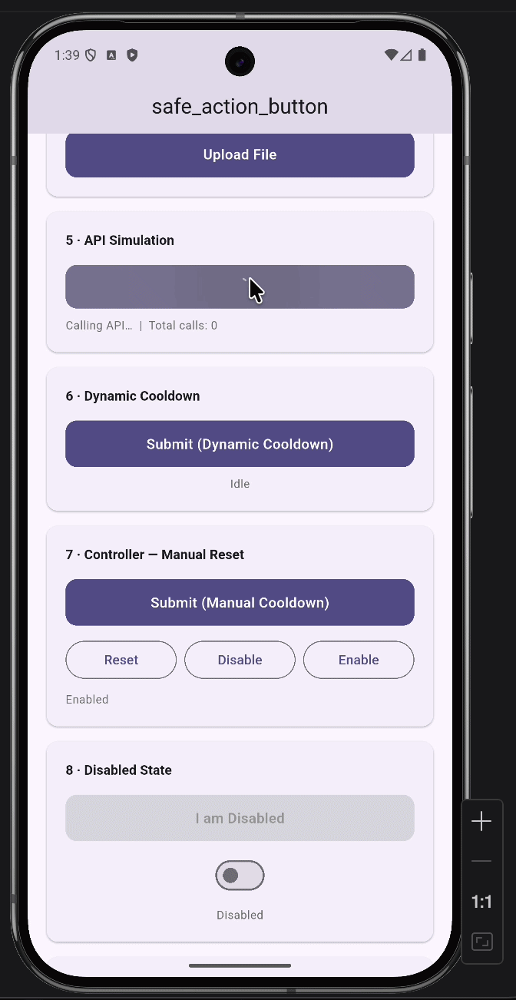
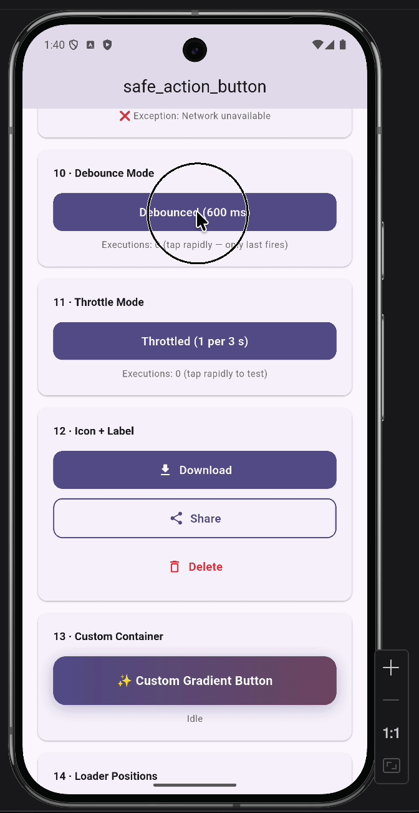

# safe_action_button

[](https://pub.dev/packages/safe_action_button)
[](LICENSE)
[](https://flutter.dev)
[](https://dart.dev)

A **production-ready** Flutter button package that prevents duplicate taps, duplicate async API calls, and accidental multiple executions — with a clean, fully-customisable API and zero external dependencies.

---

## 🎥 App Demo
<p align="center">
  
  
</p>
---

## ✨ Features

| Feature | Details |
|---|---|
| 🛡️ **Duplicate-tap prevention** | Ignores taps while an async operation is running |
| ⏱️ **Static cooldown** | Lock the button for a fixed duration after each tap |
| 🔄 **Dynamic cooldown** | Cooldown duration returned directly by your API callback |
| 🕹️ **Manual cooldown** | Re-enable only via `controller.resetCooldown()` |
| ⏳ **Debounce mode** | Collapses rapid taps — only the last fires |
| ⚡ **Throttle mode** | Leading-edge: first tap fires, rest are dropped within the interval |
| 🎨 **4 button types** | `filled` · `outlined` · `text` · `custom` |
| 🔄 **Loader positions** | `center` · `left` · `right` · `overlay` |
| 🔢 **Cooldown timer** | Optional countdown shown inside the button |
| 🎛️ **Controller API** | Programmatic `enable/disable/startLoading/stopLoading/triggerCooldown/resetCooldown` |
| 📳 **Haptic feedback** | Optional `HapticFeedback.lightImpact()` on tap |
| ♿ **Accessibility** | Full `Semantics` support |
| 🧹 **Mounted safety** | All async callbacks check `mounted` before calling `setState` |
| 🚫 **Zero dependencies** | Pure Flutter/Dart — no GetX, Bloc, Riverpod, or Provider |

---

## 📦 Installation

Add to your `pubspec.yaml`:

```yaml
dependencies:
  safe_action_button: 
```

Then run:

```bash
flutter pub get
```

---

## 🚀 Import

```dart
import 'package:safe_action_button/safe_action_button.dart';
```

---

## 🔰 Basic Usage

### Filled button

```dart
SafeActionButton.filled(
  label: 'Save',
  onTap: () async {
    await myApiCall();
    return null;
  },
)
```

### Outlined button

```dart
SafeActionButton.outlined(
  label: 'Subscribe',
  onTap: () async {
    await subscribe();
    return null;
  },
)
```

### Text button

```dart
SafeActionButton.text(
  label: 'Resend Email',
  onTap: () async {
    await resendEmail();
    return null;
  },
)
```

### Custom container button

```dart
SafeActionButton.custom(
  onTap: () async {
    await doWork();
    return null;
  },
  child: Container(
    padding: const EdgeInsets.all(20),
    decoration: BoxDecoration(
      gradient: LinearGradient(colors: [Colors.purple, Colors.blue]),
      borderRadius: BorderRadius.circular(16),
    ),
    child: const Text('Gradient Button', style: TextStyle(color: Colors.white)),
  ),
)
```

---

## 🎯 Advanced Usage

### Icon + label

```dart
SafeActionButton.filled(
  label: 'Download',
  icon: const Icon(Icons.download_rounded),
  onTap: () async {
    await downloadFile();
    return null;
  },
)
```

### All lifecycle callbacks

```dart
SafeActionButton.filled(
  label: 'Submit',
  onTap: () async {
    await submitForm();
    return null;
  },
  onCompleted: () {
    // Called after onTap succeeds, before cooldown starts
    showSuccessToast();
  },
  onError: (error, stackTrace) {
    // Called when onTap throws
    showErrorSnackBar(error.toString());
  },
  onCooldownStart: () {
    debugPrint('Cooldown started');
  },
  onCooldownEnd: () {
    debugPrint('Cooldown ended — button re-enabled');
  },
)
```

### Static cooldown

```dart
SafeActionButton.filled(
  label: 'Send OTP',
  cooldownDuration: const Duration(seconds: 30),
  showCooldownTimer: true,  // shows "29s", "28s"... inside the button
  onTap: () async {
    await sendOtp();
    return null;
  },
)
```

### Cooldown modes

```dart
// 1. Static (default)
SafeActionButton.filled(
  label: 'Static',
  cooldownMode: CooldownMode.staticDuration,
  cooldownDuration: const Duration(seconds: 3),
  onTap: () async { ... },
)

// 2. Dynamic — duration returned by your callback
SafeActionButton.filled(
  label: 'Dynamic',
  cooldownMode: CooldownMode.dynamic,
  onTap: () async {
    final response = await api.submit();
    return Duration(seconds: response.retryAfter); // server-driven cooldown
  },
)

// 3. Manual — re-enabled only by controller.resetCooldown()
SafeActionButton.filled(
  label: 'Manual',
  cooldownMode: CooldownMode.manual,
  controller: _controller,
  onTap: () async { ... },
)
```

### Debounce mode

Collapses rapid taps — only the **last** tap (after the debounce window of silence) fires `onTap`.

```dart
SafeActionButton.filled(
  label: 'Search',
  debounceMode: true,
  debounceDuration: const Duration(milliseconds: 600),
  onTap: () async {
    await performSearch();
    return null;
  },
)
```

### Throttle mode

First tap fires immediately; subsequent taps within the interval are silently dropped.

```dart
SafeActionButton.filled(
  label: 'Like',
  throttleMode: true,
  throttleDuration: const Duration(seconds: 2),
  onTap: () async {
    await likePost();
    return null;
  },
)
```

---

## 🎛️ Controller Usage

```dart
class MyWidget extends StatefulWidget {
  @override
  State<MyWidget> createState() => _MyWidgetState();
}

class _MyWidgetState extends State<MyWidget> {
  final _controller = SafeActionButtonController();

  @override
  void dispose() {
    _controller.dispose(); // always dispose!
    super.dispose();
  }

  @override
  Widget build(BuildContext context) {
    return Column(
      children: [
        SafeActionButton.filled(
          label: 'Submit',
          controller: _controller,
          onTap: () async {
            await submit();
            return null;
          },
        ),

        // Programmatic control:
        ElevatedButton(
          onPressed: _controller.disable,
          child: const Text('Disable'),
        ),
        ElevatedButton(
          onPressed: _controller.enable,
          child: const Text('Enable'),
        ),
        ElevatedButton(
          onPressed: _controller.resetCooldown,
          child: const Text('Reset Cooldown'),
        ),
        ElevatedButton(
          onPressed: () => _controller.triggerCooldown(
            duration: const Duration(seconds: 5),
          ),
          child: const Text('Force 5 s Cooldown'),
        ),
      ],
    );
  }
}
```

#### Controller API reference

| Method / Getter | Description |
|---|---|
| `startLoading()` | Shows loading indicator |
| `stopLoading()` | Hides loading indicator |
| `enable()` | Clears manual-disabled flag |
| `disable()` | Manually disables the button |
| `triggerCooldown({required Duration})` | Starts a programmatic cooldown |
| `resetCooldown()` | Immediately ends active cooldown |
| `isLoading` | Whether loading is active |
| `isDisabled` | Whether button is manually disabled |
| `isInCooldown` | Whether cooldown is active |
| `remainingCooldown` | Remaining cooldown `Duration?` |
| `isInteractable` | `true` when button accepts taps |

---

## ⚡ Dynamic Cooldown Example

Perfect for APIs that return a `Retry-After` header:

```dart
SafeActionButton.filled(
  label: 'Submit',
  cooldownMode: CooldownMode.dynamic,
  showCooldownTimer: true,
  onTap: () async {
    final response = await http.post(Uri.parse('/api/submit'));

    if (response.statusCode == 429) {
      final retryAfter = int.parse(response.headers['retry-after'] ?? '5');
      return Duration(seconds: retryAfter); // dynamic cooldown
    }

    return null; // no cooldown on success
  },
)
```

---

## 🎨 Full Customisation Example

```dart
SafeActionButton.filled(
  label: 'Purchase Now',
  icon: const Icon(Icons.shopping_cart_rounded),
  hapticFeedback: true,
  showCooldownTimer: true,
  cooldownDuration: const Duration(seconds: 5),
  semanticLabel: 'Purchase button',
  tooltip: 'Tap to complete your purchase',
  style: SafeButtonStyle(
    width: double.infinity,
    height: 56,
    padding: const EdgeInsets.symmetric(horizontal: 24, vertical: 16),
    borderRadius: BorderRadius.circular(28),
    backgroundColor: const Color(0xFF6C63FF),
    foregroundColor: Colors.white,
    disabledColor: Colors.grey.shade300,
    loadingColor: Colors.white,
    fontSize: 16,
    fontWeight: FontWeight.w700,
    iconSpacing: 10,
    loaderPosition: LoaderPosition.right,
    animationDuration: const Duration(milliseconds: 300),
    shadows: [
      BoxShadow(
        color: const Color(0xFF6C63FF).withOpacity(0.4),
        blurRadius: 20,
        offset: const Offset(0, 6),
      ),
    ],
  ),
  onTap: () async {
    await processPurchase();
  },
  onCompleted: () => showSuccessDialog(),
  onError: (e, _) => showErrorDialog(e),
  onCooldownStart: () => debugPrint('Cooldown started'),
  onCooldownEnd: () => debugPrint('Cooldown ended'),
)
```
---

## 🤝 Contributing

Contributions are welcome! Please follow these steps:

1. Fork the repository
2. Create a feature branch: `git checkout -b feat/my-feature`
3. Commit your changes: `git commit -m 'feat: add my feature'`
4. Push to the branch: `git push origin feat/my-feature`
5. Open a Pull Request

Please make sure all tests pass before submitting:

```bash
flutter test
flutter analyze
```

---

## 📄 License

This project is licensed under the **MIT License** — see the [LICENSE](LICENSE) file for details.

---

<p align="center">Made with ❤️ for the Flutter community</p>
